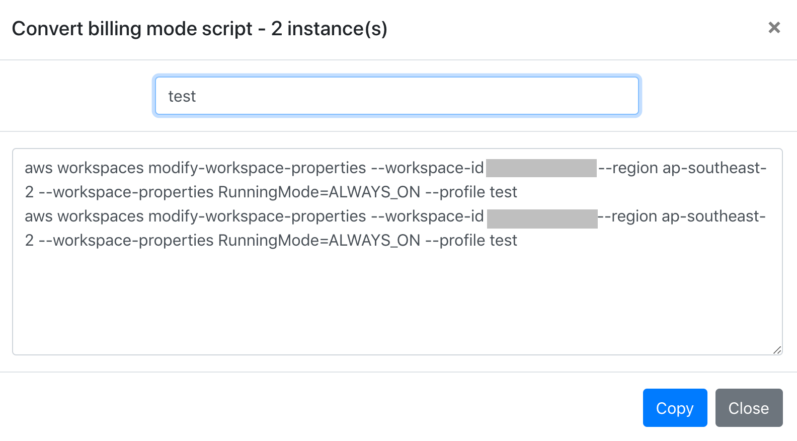

# Amazon WorkSpaces Cost Optimisation

This solution provides a dashboard that analyses Amazon WorkSpace usage within an account.

This is a Node.js conversion of the existing project that provides a full deployable solution to AWS but for one off usage by customers:

- [WorkSpaces Cost Optimizer](https://docs.aws.amazon.com/solutions/latest/workspaces-cost-optimizer/welcome.html)

It adds the enhancement a simpler deployed footprint (Lambda function based) and a detailed analytics dashboard.

This project does not aim to auto-remediate customer's accounts but does provide the ability to generate scripts that customers can use to adjust billing modes in their account via the AWS CLI.

## TODO

1. Compute a days since use field
2. Suggest idle instances based on days since use
3. User interface control that shows root, user and extra user storage
4. Consider automated conversions based on recommendations
5. Display cost savings for recommendations
6. Support tag based filtering

## Important Notes

Read the [Amazon WorkSpaces FAQ - Billing and Pricing](https://aws.amazon.com/workspaces/faqs/#Billing_and_Pricing) and [Amazon WorkSpaces Pricing](https://aws.amazon.com/workspaces/pricing/) pages.

**Q: Can I switch between hourly and monthly billing?**

Yes, you can switch from hourly to monthly billing for your Amazon WorkSpaces at any time by switching the running mode to AlwaysOn in the AWS Management Console, or through the Amazon WorkSpaces APIs. When you switch, billing immediately changes from hourly to monthly, and you are charged a prorated amount at the monthly rate for the remainder of the month, along with the monthly and hourly usage fees already billed for the month. Your Amazon WorkSpaces will continue to be charged monthly unless you switch the running mode back to AutoStop.

You can switch from monthly to hourly billing by setting the running mode to AutoStop in the AWS Management Console or through the Amazon WorkSpaces APIs. Switching from monthly to hourly billing will take effect the following month as you will have already paid for your Amazon WorkSpaces for that month. Your Amazon WorkSpaces will continue to be charged hourly unless you switch the running mode back to AlwaysOn. Your Amazon WorkSpaces will continue to be charged hourly unless you switch the running mode back to AlwaysOn. **Please note that billing renewals happen at 00:00 Pacific Time on the first of each month.**

WorkSpaces users can also switch between monthly and hourly billing directly from the WorkSpaces client if this self-service management capability is enabled by their WorkSpaces administrator.

## Credentials

You will need an IAM admin user locally to deploy the solution (or sufficient privelidges to deploy AWS Lambda Functions, create Amazon API Gateway End Points, IAM roles and S3 buckets.

## Server deployment

This is Serverless.com application and you will need Node.js installed to deploy it:

- [Install Node for your Platform](https://nodejs.org/en/download/)

Install serverless:

	npm install -g serverless

Run the command to fetch the dependencies locally:

	npm install

Deploy using:

	serverless deploy --profile <AWS profile name> --stage <stage>
	
Make a note of the S3 bucket, API Gateway url and generated API key that are written to the console.

## Post deployment configuration

Log into the AWS console and locate the Lambda function: 
	
	<stage>-aws-workspaces-optimisation-function
	
Edit the environment properties and set the WorkSpaces directory id and update the BYOL flag to true or false.
 
## Dashboard configuration

Prior to deploying your dashboard to S3, you need to edit the web/site_config.json file to point to your deployed API Gateway endpoint:

    {
      "availableDataUrl": "https://<api>.execute-api.ap-southeast-2.amazonaws.com/<stage>/workspaces/data",
      "region": "ap-southeast-2"
	}
	  
Edit the availableDataUrl field and enter the URL output from the Serverless deployment script for example:

    endpoints:
	  GET - https://<api>.execute-api.ap-southeast-2.amazonaws.com/dev/workspaces/data

Also update the AWS region code (for example: ap-southeast-2).

## Dashboard deployment

Deploy your dashboard into S3:
	
	cd web/
	aws s3 cp . s3://<stage>-aws-workspaces-optimisation-<region>-<account number>/apps/workspaces/web/ --recursive --acl public-read
	
## Access your dashboard

Edit this URL to replace the stage, region and account number and open in your browser:

	https://<stage>-aws-workspaces-optimisation-<region>-<account number>.s3-<region>.amazonaws.com/apps/workspaces/web/index.html

Click on the **Log in** link:
	

This shows the login dialog and you can paste in your API key:

Once you have entered a valid API key you should be able to access your dashboard and recommendation tabs:

The charts are clickable and will link to filtered pages showing the list of instances that make up each category.

The recommendations tab shows recommended changes to billing modes.

Select the instances you wish to convert and press the **Generate script** button to make an AWS CLI script for switching billing modes:

You may also enter an optional AWS profile name and use the **Copy** button to copy the script to the clipboard. 

A graph showing cumulative usage are also provided for each instance:

The graph plots the current cumulative usage, the predicted usage, the optimal monthly and daily usage. The graph is useful to investigate individual user activity and predict early in the month if a user will consume enough hours to warrant switching to monthly (always on) billing.

## Cost implications

When converting monthly billing instances to hourly instances the change actually takes effect at the start of the next month.

When converting to monthly instances from hourly instances, the existing hourly usage is still charged (including the base cost) and a pro-rata monthly fee is applied based on the number of days left in the month.

For more information see:

- [Amazon WorkSpaces FAQ - Billing and Pricing](https://aws.amazon.com/workspaces/faqs/#Billing_and_Pricing)

## Acknowledgements

Special thanks goes to Robbie Cooray for his amazing efforts in testing and verification!

